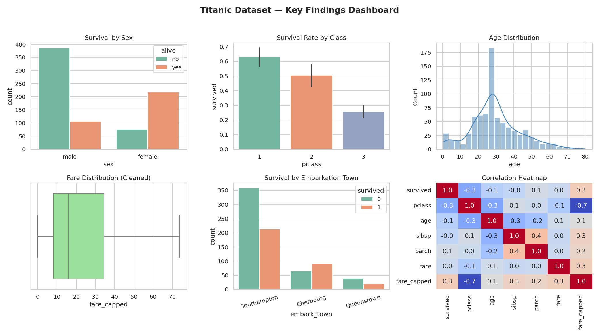

# Titanic Dataset — Data Preprocessing, EDA & Visualization

An intern data-analysis project focused on **data cleaning, exploratory data analysis (EDA), and storytelling with data** using Python.

## Key Features
- Handles **missing values**, **outliers**, and **duplicate rows**
- Uses **Pandas**, **Matplotlib**, and **Seaborn** for analysis and visualization
- Produces a **summary dashboard** of key findings

## Project Structure
```
├── data/
│   └── titanic_raw.csv              # Raw dataset (with injected duplicates/outliers)
├── outputs/
│   ├── titanic_cleaned.csv          # Cleaned dataset
│   ├── summary_statistics.csv       # Descriptive statistics
│   └── 01–07_*.png                  # Individual charts + final dashboard
├── Titanic_Data_Analysis.ipynb      # Main notebook (recommended entry point)
├── analysis.py                      # Same analysis as a standalone script
└── requirements.txt
```

## How to Run
```bash
pip install -r requirements.txt
jupyter notebook Titanic_Data_Analysis.ipynb
```
Or run the script version directly:
```bash
python analysis.py
```

## Data Cleaning Steps
| Issue | Approach |
|---|---|
| Duplicate rows | Detected with `duplicated()`, removed with `drop_duplicates()` |
| Missing `age` | Filled with median |
| Missing `embarked` / `embark_town` | Filled with mode |
| Missing `deck` (~77% missing) | Column dropped |
| Outliers in `fare` | Detected via IQR method, capped instead of dropped |

## Key Findings
- **Sex** was the strongest predictor of survival — women survived at a much higher rate than men.
- **Passenger class** mattered: 1st class survival rate was more than double that of 3rd class.
- Most passengers were **young adults (20–40)**.
- **Fare** correlates strongly with class, and mildly with survival.

## Dashboard Preview


## Tech Stack
Python · Pandas · NumPy · Matplotlib · Seaborn · Jupyter
